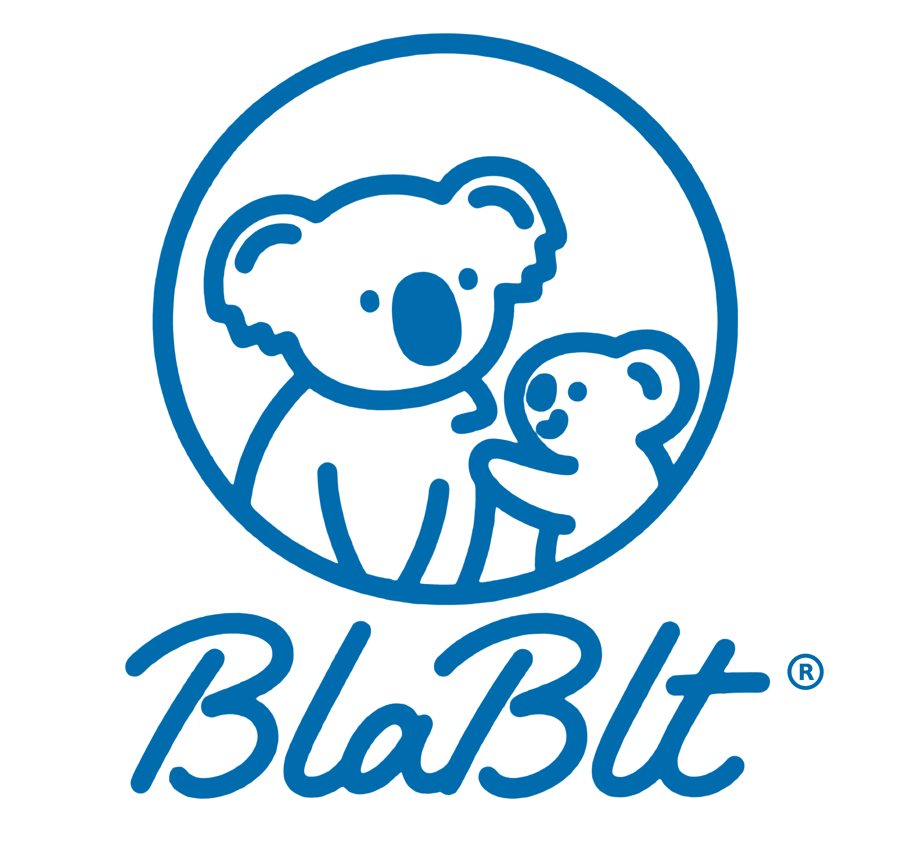

# 🗣️ BlabIt ✨

> *Pages of linguistic enchantment, your speaking magic book unfolds*

🏆 This project originally started as part of the Macathon competition. <u><b>The code related to the competition will stay on a specific branch (named `end_of_macathon_2025`) when the deadline hits</b></u>, but the project itself will keep being developed afterward.

## 🌟 What is BlabIt?
BlabIt is a magical toolkit that leverages the power of AI to help you navigate the world of English oral communication. Like a trusted guide through unfamiliar linguistic landscapes, our app offers:

- **The Context Whisperer** 🧙‍♂️ - Provides situational context and suggests appropriate phrases for different conversation scenarios
- **English Enhancement Enchanter** ✒️ - Identifies and helps correct speech patterns, grammar issues, and expression improvements
- **Mother Tongue Mirror** 🎙️ - Provides appropriate translations for each of your spoken phrases

## ✨ Magical Updates En Route

Our spell-crafters are brewing new enchantments to further empower your linguistic journey. Soon the pages of your speaking magic book will reveal:

- **Accent Alchemy** 🔮 - Transform your pronunciation with guided incantations and mystical feedback
- **Vocabulary Vault** 📚 - Unlock treasured expressions that native speakers keep in their secret collections
- **Immersive Illusions** 🌌 - Step into enchanted scenarios where language comes alive in authentic contexts

## 🚀 Getting Started

https://balbit.xyz 

## 🔴 Critical Bugs

- **SECURITY ALERT**: ⚠️ Website certificates have been synchronized to GitHub for development purposes, creating potential security vulnerabilities. This issue will be resolved when certificates expire and are replaced in 90 days.

## 🐛 Current Issues

- API connectivity occasionally fails when server load is high
- Speech recognition accuracy varies with background noise
- Mobile responsiveness needs improvement on smaller screens
- Backend service occasionally returns malformed JSON responses

## 🔄 New Update

- None

## 📜 Development Todo List

- Return Home page without returning to first page
- New Swipe Lib

"Language is the road map of a culture. It tells you where its people come from and where they are going." – Rita Mae Brown